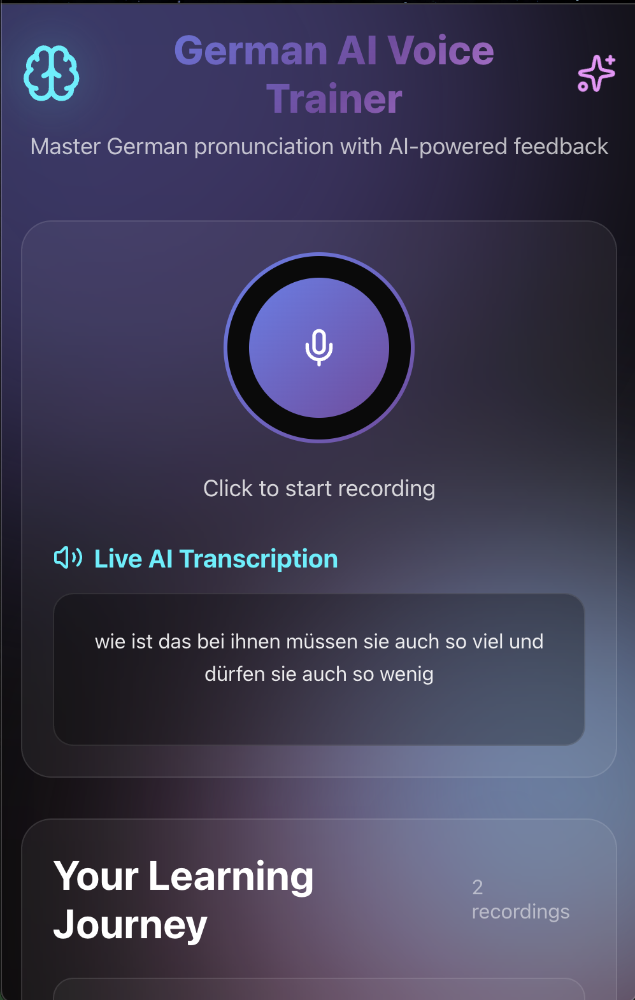

German AI Voice Trainer 🇩🇪🤖

A full-stack web application designed to help users master German pronunciation through AI-powered feedback. This project demonstrates the rapid integration of a Python backend with a React frontend to create a modern, interactive learning tool.

✨ Features
🎙️ Live Voice Recording: Easily record your voice directly in the browser.

🤖 AI-Powered Transcription: Get instant, live transcription of your spoken German.

🧠 Pronunciation Feedback (Future): The architecture is built to support AI-driven feedback on pronunciation accuracy.

📖 Learning Journey: Keep track of all your recordings to monitor your progress over time.

🎨 Modern UI: A sleek, user-friendly interface built with React.

🛠️ Tech Stack
The application uses a Python backend to serve a RESTful API, which is consumed by a React frontend. This demonstrates a modern, decoupled full-stack architecture.

